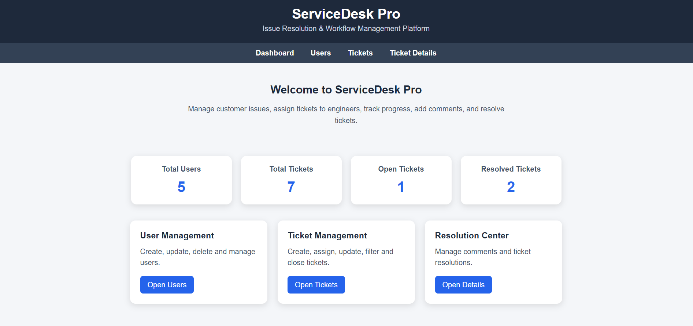
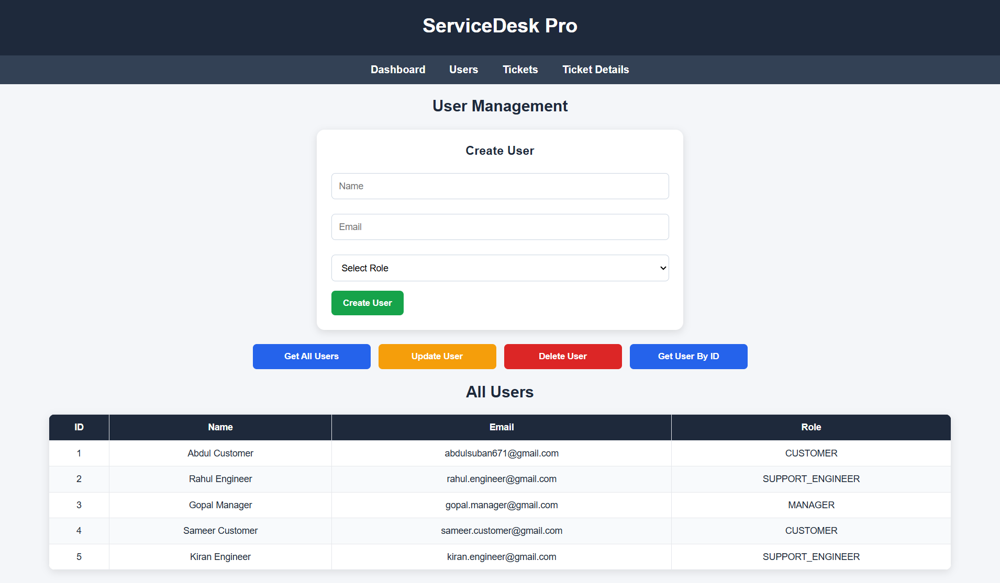
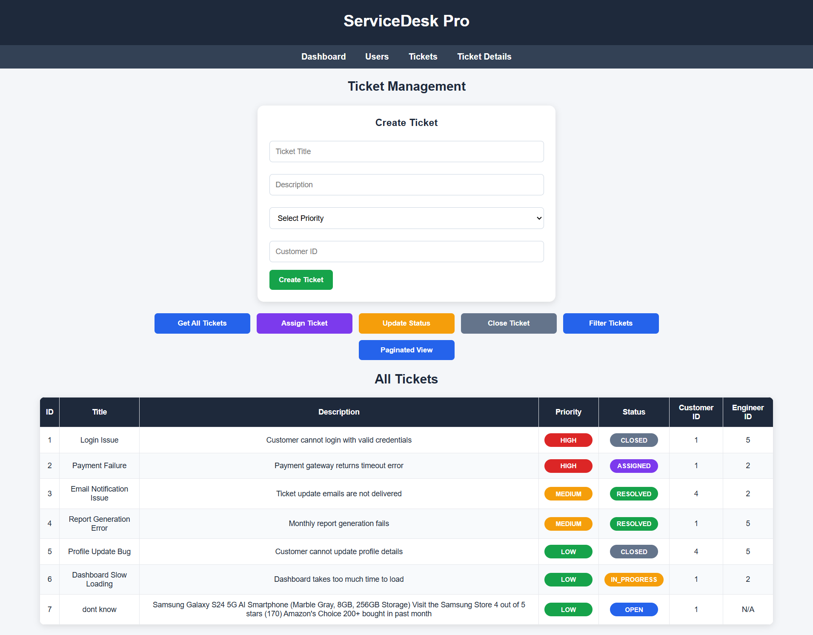
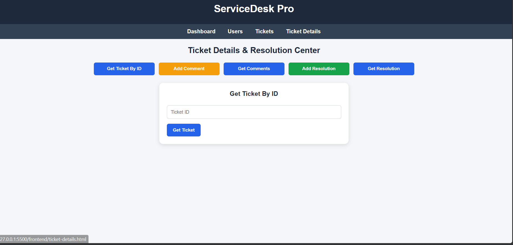

# ServiceDesk Pro – Issue Resolution & Workflow Management Platform

## Overview

ServiceDesk Pro is a backend-driven ticket management system designed to streamline issue resolution workflows within an organization. The platform enables customers to raise support tickets, managers to assign tickets to support engineers, and engineers to investigate, resolve, and close issues through a structured lifecycle.

The project was developed to simulate a real-world service desk environment and demonstrate backend development concepts including RESTful API design, layered architecture, DTO pattern, validation, exception handling, filtering, pagination, sorting, and API documentation.

----------------------------------------------------------------------------------------------

## Highlights

* Built a full-stack service desk application using Java, Spring Boot, MySQL, and HTML/CSS/JavaScript
* Implemented layered backend architecture: Controller → Service → Repository
* Designed RESTful APIs for user, ticket, comment, and resolution management
* Used DTOs for clean request and response handling
* Added role-based business rules for customers, support engineers, and managers
* Implemented ticket workflow: OPEN → ASSIGNED → IN_PROGRESS → RESOLVED → CLOSED
* Added validation, custom exceptions, and global exception handling
* Implemented filtering by status, priority, assigned engineer, and customer
* Added pagination and dynamic sorting for tickets
* Integrated Swagger/OpenAPI for API testing and documentation
* Built a lightweight frontend using HTML, CSS, and Vanilla JavaScript
* Connected frontend pages to Spring Boot APIs using Fetch API
* Added dashboard statistics, status badges, priority badges, and responsive UI styling

---------------------------------------------------------------------------------------------

## Problem Statement

Organizations often struggle to track customer issues efficiently due to scattered communication, lack of accountability, and poor visibility into issue status.

ServiceDesk Pro addresses these problems by providing:

* Centralized issue tracking
* Ticket assignment workflow
* Progress monitoring
* Resolution documentation
* Historical audit trail through comments and resolutions

-------------------------------------------------------------------------------------------------

## System Workflow

Customer
    │
    ▼
Create Ticket
    │
    ▼
Manager Assigns Ticket
    │
    ▼
Support Engineer Works On Ticket
    │
    ▼
Add Comments & Status Updates
    │
    ▼
Add Resolution
    │
    ▼
Ticket Resolved
    │
    ▼
Ticket Closed


-----------------------------------------------------------------------------------------------

## Role Responsibilities

### CUSTOMER

* Create tickets
* View ticket details
* Track ticket progress
* Add comments to their own assigned or in-progress tickets

### SUPPORT_ENGINEER

* Work on assigned tickets
* Update ticket status
* Add comments to assigned tickets
* Add resolutions to assigned tickets
* Resolve customer issues

### MANAGER

* Assign tickets to support engineers
* Monitor ticket progress
* Oversee ticket workflow and issue resolution


-------------------------------------------------------------------------------------------------

## Business Rules

The application enforces the following workflow and validation rules:

### User Rules

* User email addresses must be unique across the system.
* A user cannot be deleted if tickets are created by that user.
* A user cannot be deleted if tickets are assigned to that user.

### Ticket Creation

* Only users with the `CUSTOMER` role can create tickets.
* Newly created tickets are assigned the `OPEN` status by default.

### Ticket Assignment

* Tickets can only be assigned to users with the `SUPPORT_ENGINEER` role.
* Only tickets in the `OPEN` state can be assigned.
* Assigned tickets automatically move to the `ASSIGNED` state.

### Ticket Status Updates

* Only the assigned support engineer can update the ticket status.
* Ticket status cannot be updated if the ticket is already `CLOSED`.
* Tickets must be assigned before their status can be updated.

### Ticket Comments

* Comments can only be added to tickets in the `ASSIGNED` or `IN_PROGRESS` state.
* Only the assigned support engineer and the customer who created the ticket can add comments.
* Comments cannot be added to `RESOLVED` tickets.
* Comments cannot be added to `CLOSED` tickets.

### Ticket Resolution

* Only users with the `SUPPORT_ENGINEER` role can add resolutions.
* Only the assigned support engineer can resolve a ticket.
* A ticket can have only one resolution.
* Only tickets in the `ASSIGNED` or `IN_PROGRESS` state can be resolved.
* Closed tickets cannot be resolved.
* Adding a resolution automatically updates the ticket status to `RESOLVED`.

### Ticket Closure

* Only tickets in the `RESOLVED` state can be closed.
* A ticket cannot be closed more than once.

### Error Handling

* Invalid user, ticket, or resolution requests return meaningful error messages through custom exception handling.
* Global exception handling provides consistent API error responses.

-------------------------------------------------------------------------------------------------

## Tech Stack

### Backend

* Java 21
* Spring Boot
* Spring Web
* Spring Data JPA
* Hibernate ORM

### Database

* MySQL

### Frontend

* HTML5
* CSS3
* Vanilla JavaScript
* Fetch API

### Documentation & Testing

* Swagger / OpenAPI
* Postman

### Development Tools

* IntelliJ IDEA
* MySQL Workbench
* Git & GitHub

### Utilities

* Lombok
* Jakarta Bean Validation


-----------------------------------------------------------------------------------------------

## Architecture

```text
Client (Postman / Swagger / Frontend)
                │
                ▼
          Controller Layer
                │
                ▼
            Service Layer
                │
                ▼
          Repository Layer
                │
                ▼
             MySQL Database
```
------------------------------------------------------------------------------------------------

## Project Structure

```text
servicedesk-pro

├── frontend
│   ├── index.html
│   ├── users.html
│   ├── tickets.html
│   ├── ticket-details.html
│   │
│   ├── css
│   │   └── style.css
│   │
│   └── js
│       ├── api.js
│       ├── dashboard.js
│       ├── users.js
│       ├── tickets.js
│       └── ticket-details.js
│
├── src/main/java/com/servicedesk/servicedesk_pro
│   ├── controller
│   ├── service
│   ├── repository
│   ├── model
│   ├── dto
│   ├── enums
│   ├── exception
│   ├── config
│   └── ServicedeskProApplication.java
│
├── screenshots
│
└── src/main/resources
    └── application.properties
```


------------------------------------------------------------------------------------------------

## Database Entities

### User

-id
-name
-email
-role
-createdAt

### Ticket

-id
-title
-description
-priority
-status
-createdAt
-updatedAt
-createdBy
-assignedTo

### Comment

-id
-message
-createdAt
-ticket
-commentedBy

### Resolution

-id
-rootCause
-solution
-resolvedAt
-ticket
-resolvedBy


-----------------------------------------------------------------------------------------------

## Ticket Lifecycle

OPEN
  │
  ▼
ASSIGNED
  │
  ▼
IN_PROGRESS
  │
  ▼
RESOLVED
  │
  ▼
CLOSED

-------------------------------------------------------------------------------------------

## Implemented Features

### User Management

* Create User
* Get All Users
* Get User By ID
* Update User
* Delete User

### Ticket Management

* Create Ticket
* Get All Tickets
* Get Ticket By ID
* Assign Ticket
* Update Ticket Status
* Close Ticket

### Comment Management

* Add Comment
* Get Comments By Ticket

### Resolution Management

* Add Resolution
* Get Resolution By Ticket

### Filtering

* Filter Tickets by Status
* Filter Tickets by Priority
* Filter Tickets by Assigned Engineer
* Filter Tickets by Customer

### Pagination & Sorting

* Pagination Support
* Dynamic Sorting
* Configurable Page Size

### Validation & Exception Handling

* DTO-based Request/Response Handling
* Bean Validation
* Global Exception Handling
* Custom Exception Classes

### Frontend UI

* Dashboard Page
* User Management Page
* Ticket Management Page
* Ticket Details Page
* Status Badges
* Priority Badges
* Color-Coded Action Buttons
* Responsive Layout
* Fetch API Integration


--------------------------------------------------------------------------------------------

## Frontend UI

The project includes a lightweight frontend built using HTML, CSS, and Vanilla JavaScript. The frontend communicates with the Spring Boot backend using the Fetch API.

### Frontend Pages

* Dashboard page with live statistics
* User Management page for creating, viewing, updating, and deleting users
* Ticket Management page for creating, assigning, updating, closing, filtering, and paginating tickets
* Ticket Details page for viewing ticket details, adding comments, viewing comments, adding resolutions, and viewing resolutions

### UI Enhancements

* Dashboard statistics cards
* Status badges for ticket status
* Priority badges for ticket priority
* Color-coded action buttons
* Responsive layout
* Dynamic forms and tables using JavaScript

--------------------------------------------------------------------------------------------

## API Endpoints

### User APIs

| Method   | Endpoint            |
|----------|-------------------- |
| POST     | /api/users          |
| GET      | /api/users          |
| GET      | /api/users/{userId} |
| PUT      | /api/users/{userId} |
| DELETE   | /api/users/{userId} |

### Ticket APIs

| Method | Endpoint                                    |
| ------ | ------------------------------------------- |
| POST   | /api/tickets                                |
| GET    | /api/tickets                                |
| GET    | /api/tickets/{ticketId}                     |
| PUT    | /api/tickets/{ticketId}/assign/{engineerId} |
| PUT    | /api/tickets/{ticketId}/status              |
| PUT    | /api/tickets/{ticketId}/close               |

### Comment APIs

| Method | Endpoint                         |
| ------ | -------------------------------- |
| POST   | /api/tickets/{ticketId}/comments |
| GET    | /api/tickets/{ticketId}/comments |

### Resolution APIs

| Method | Endpoint                           |
| ------ | ---------------------------------- |
| POST   | /api/tickets/{ticketId}/resolution |
| GET    | /api/tickets/{ticketId}/resolution |

### Filter APIs

| Method | Endpoint                           |
| ------ | ---------------------------------- |
| GET    | /api/tickets/status/{status}       |
| GET    | /api/tickets/priority/{priority}   |
| GET    | /api/tickets/assigned/{engineerId} |
| GET    | /api/tickets/customer/{customerId} |

### Pagination APIs

| Method | Endpoint                                                           |
| ------ | ------------------------------------------------------------------ |
| GET    | /api/tickets/page?page=0&size=5                                    |
| GET    | /api/tickets/page-sort?page=0&size=5&sortBy=priority&direction=asc |

-----------------------------------------------------------------------------------------------

## Sample Requests

### Create User

```json
{
  "name": "Abdul",
  "email": "abdul@gmail.com",
  "role": "CUSTOMER"
}
```

### Create Ticket

```json
{
  "title": "Login Issue",
  "description": "Unable to login",
  "priority": "HIGH",
  "createdById": 1
}
```

### Add Resolution

```json
{
  "rootCause": "Authentication service configuration issue",
  "solution": "Updated configuration and restarted the service",
  "resolvedById": 2
}
```

-----------------------------------------------------------------------------------------------

## Validation Strategy

The application uses Jakarta Bean Validation.

Implemented annotations include:

@NotBlank
@NotNull
@Email
@Valid

Validation failures are handled centrally through Global Exception Handling.

---------------------------------------------------------------------------------------------

## Exception Handling Strategy

Custom exceptions:

UserNotFoundException
TicketNotFoundException
ResolutionNotFoundException

Centralized using:

```java
@RestControllerAdvice
```

This ensures consistent API error responses across the application.

-------------------------------------------------------------------------------------------------

## Swagger Documentation

Swagger/OpenAPI is integrated for API exploration and testing.

Access:

```text
http://localhost:8080/swagger-ui/index.html
```

-------------------------------------------------------------------------------------------------

## Screenshots

### Frontend Dashboard



### User Management UI



### Ticket Management UI



### Ticket Details & Resolution UI



### Swagger Documentation


### Ticket Creation API


### Ticket Filtering


### Ticket Response DTO


### Pagination and Sorting Support


### Entity Relationship Diagram


### Database Schema


-----------------------------------------------------------------------------------------------

## How to Run

### Prerequisites

Ensure the following software is installed on your system:

* Java 21
* MySQL
* Maven

For frontend development:

* A modern web browser
* VS Code Live Server extension (optional but recommended)

---

### Clone the Repository

```bash
git clone https://github.com/suban07/service-desk-pro.git
cd service-desk-pro
```

---

### Create the Database

Create a MySQL database:

```sql
CREATE DATABASE servicedesk_db;
```

---

### Configure Database Connection

Open:

```text
src/main/resources/application.properties
```

Update the database configuration:

```properties
spring.datasource.url=jdbc:mysql://localhost:3306/servicedesk_db
spring.datasource.username=root (or your user name if have)
spring.datasource.password=your_password

spring.jpa.hibernate.ddl-auto=update
spring.jpa.show-sql=true
```

---

### Run Backend Using IntelliJ IDEA

1. Open the project in IntelliJ IDEA.
2. Wait for Maven dependencies to download.
3. Navigate to:

```text
src/main/java/com/servicedesk/servicedesk_pro/ServicedeskProApplication.java
```

4. Right-click `ServicedeskProApplication.java`.
5. Select:

```text
Run 'ServicedeskProApplication'
```

The backend server will start at:

```text
http://localhost:8080
```

---

### Run Backend Using VS Code

#### Required Extensions

Install the following VS Code extensions:

* Extension Pack for Java
* Spring Boot Extension Pack

Open the project folder in VS Code.

Ensure the terminal is opened in the project root directory where `pom.xml` is located.

Run:

```bash
mvn spring-boot:run
```

If Maven is not installed globally, use the Maven Wrapper:

```bash
.\mvnw spring-boot:run
```

The backend server will start at:

```text
http://localhost:8080
```

---

### Access Swagger Documentation

After starting the backend, open:

```text
http://localhost:8080/swagger-ui/index.html
```

---

### Run the Frontend

Ensure the Spring Boot backend is running first.

Open:

```text
frontend/index.html
```

You may open the file directly in a browser.

Recommended approach:

1. Open the project in VS Code.
2. Install the Live Server extension.
3. Right-click `frontend/index.html`.
4. Select **Open with Live Server**.

The frontend communicates with the backend using:

```javascript
const API_BASE_URL = "http://localhost:8080";
```


--------------------------------------------------------------------------------------------

## Author

**Dudekula Abdul Suban**

B.Tech – Computer Science and Engineering  
SASTRA Deemed University

- Email: 227003171@sastra.ac.in
- LinkedIn: https://www.linkedin.com/in/dudekula-abdul-suban-5b906b329/
- GitHub: https://github.com/suban07

## Repository

GitHub: https://github.com/suban07/service-desk-pro
