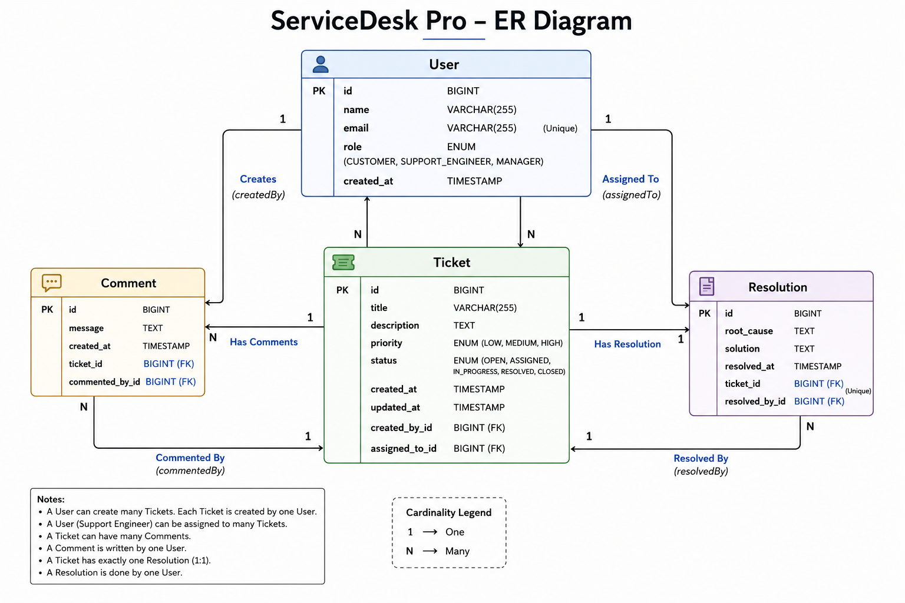
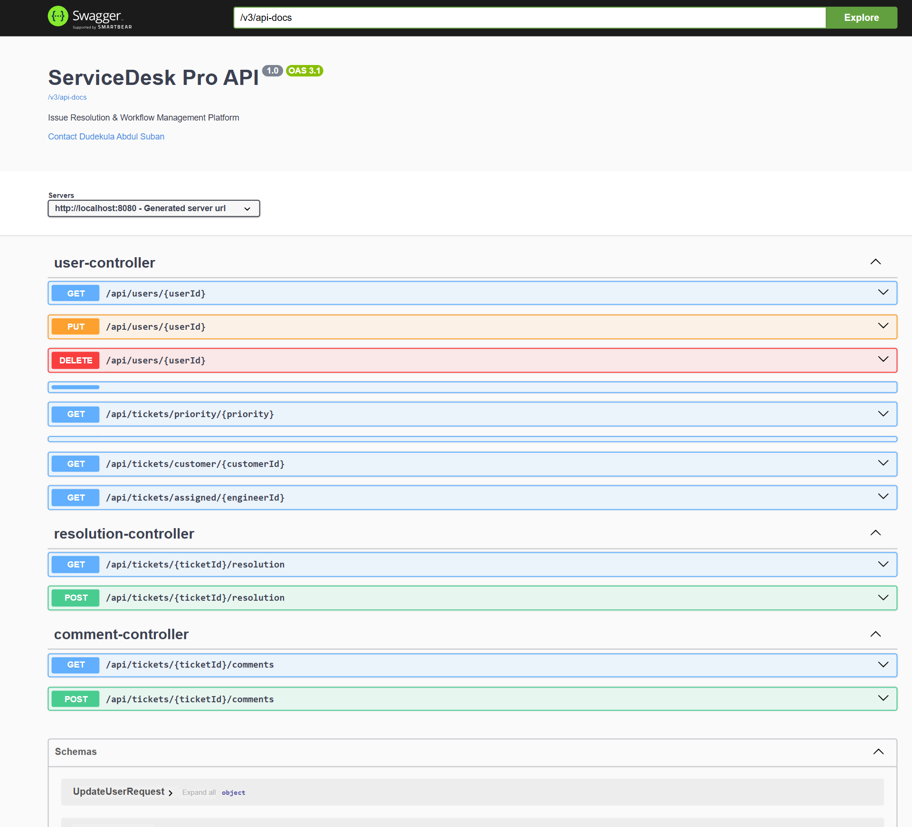
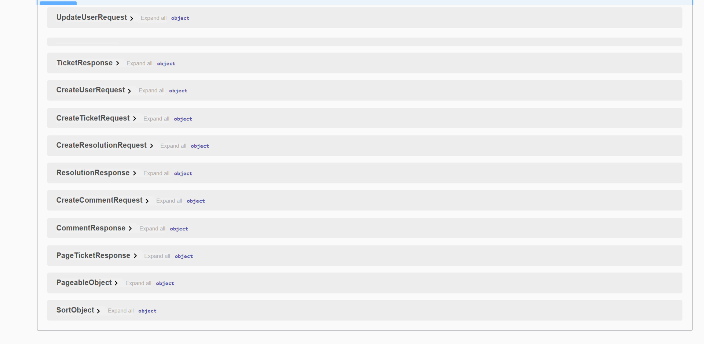
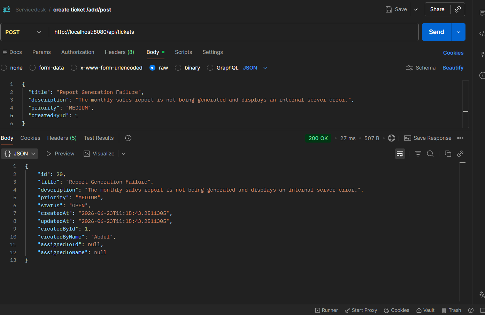
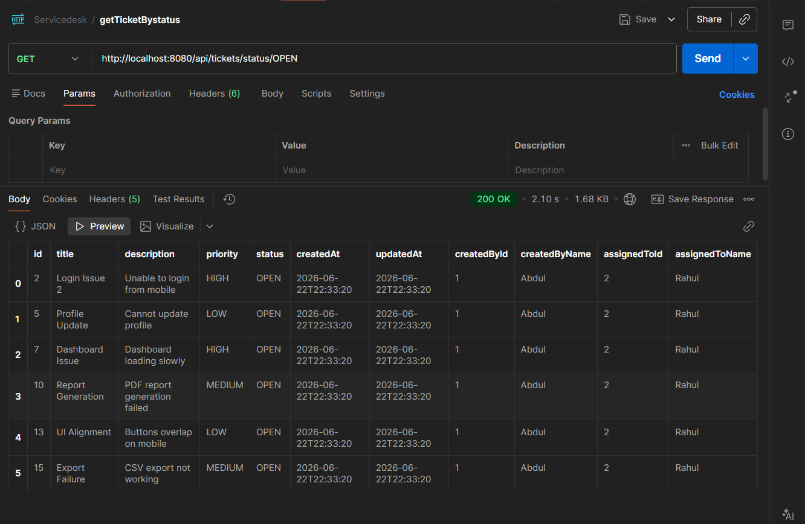
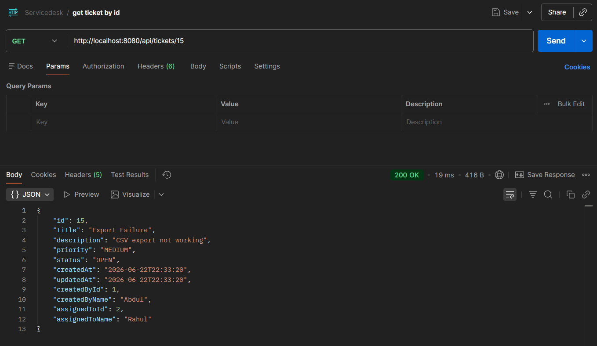
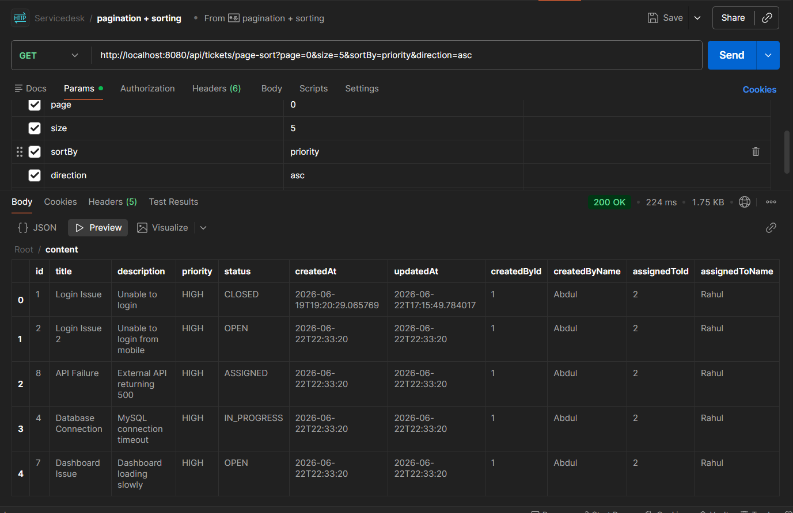
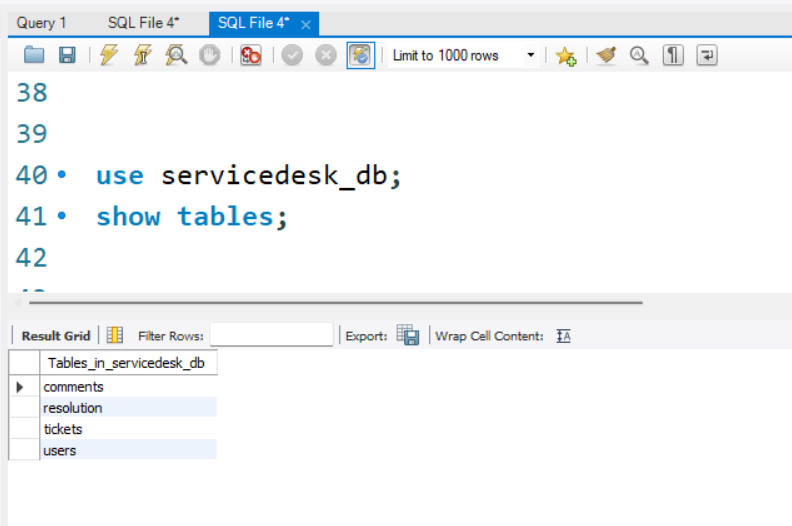

# ServiceDesk Pro – Issue Resolution & Workflow Management Platform

## Overview

ServiceDesk Pro is a backend-driven ticket management system designed to streamline issue resolution workflows within an organization. The platform enables customers to raise support tickets, managers to assign tickets to support engineers, and engineers to investigate, resolve, and close issues through a structured lifecycle.

The project was developed to simulate a real-world service desk environment and demonstrate backend development concepts including RESTful API design, layered architecture, DTO pattern, validation, exception handling, filtering, pagination, sorting, and API documentation.

----------------------------------------------------------------------------------------------

## Highlights

* Built using Java 21, Spring Boot, Spring Data JPA, and MySQL
* Implemented layered architecture (Controller → Service → Repository)
* Designed RESTful APIs for complete ticket lifecycle management
* Used DTO pattern for request and response handling
* Added Bean Validation for request validation
* Implemented Global Exception Handling
* Added filtering APIs for status, priority, engineer, and customer
* Implemented pagination and sorting
* Integrated Swagger/OpenAPI documentation
* Followed clean architecture and separation of concerns principles

---------------------------------------------------------------------------------------------

## Problem Statement

Organizations often struggle to track customer issues efficiently due to scattered communication, lack of accountability, and poor visibility into issue status.

ServiceDesk Pro addresses these problems by providing:

* Centralized issue tracking
* Ticket assignment workflow
* Progress monitoring
* Resolution documentation
* Historical audit trail through comments and resolutions

-------------------------------------------------------------------------------------------------

## System Workflow

Customer
    │
    ▼
Create Ticket
    │
    ▼
Manager Assigns Ticket
    │
    ▼
Support Engineer Works On Ticket
    │
    ▼
Add Comments & Status Updates
    │
    ▼
Add Resolution
    │
    ▼
Ticket Resolved
    │
    ▼
Ticket Closed


-----------------------------------------------------------------------------------------------

## Role Responsibilities

### CUSTOMER

* Create tickets
* View ticket details
* Track ticket progress

### SUPPORT_ENGINEER

* Work on assigned tickets
* Update ticket status
* Add comments
* Add resolutions

### MANAGER

* Assign tickets to support engineers
* Monitor ticket progress
* Oversee ticket workflow

-------------------------------------------------------------------------------------------------

## Business Rules

The application enforces the following workflow rules:

### Ticket Creation

- Only users with the `CUSTOMER` role can create tickets.

### Ticket Assignment

- Tickets can only be assigned to users with the `SUPPORT_ENGINEER` role.
- Only tickets in the `OPEN` state can be assigned.

### Ticket Status Updates

- Only the assigned support engineer can update the ticket status.

### Ticket Resolution

- Only the assigned support engineer can add a resolution.
- Adding a resolution automatically updates the ticket status to `RESOLVED`.

### Ticket Closure

- Only tickets in the `RESOLVED` state can be closed.

### User Constraints

- User email addresses must be unique across the system.

-------------------------------------------------------------------------------------------------

## Tech Stack

### Backend

* Java 21
* Spring Boot
* Spring Web
* Spring Data JPA
* Hibernate

### Database

* MySQL

### Documentation & Testing

* Postman
* Swagger / OpenAPI

### Utilities

* Lombok
* Jakarta Validation

-----------------------------------------------------------------------------------------------

## Architecture

```text
Client (Postman / Swagger / Frontend)
                │
                ▼
          Controller Layer
                │
                ▼
            Service Layer
                │
                ▼
          Repository Layer
                │
                ▼
             MySQL Database
```
------------------------------------------------------------------------------------------------

## Project Structure

```text
src/main/java/com/servicedesk/servicedesk_pro

├── controller
├── service
├── repository
├── model
├── dto
├── enums
├── exception
├── config
└── ServiceDeskProApplication.java
```

--------------------------------------------------------------------------------------------

## Entity Relationship Diagram


------------------------------------------------------------------------------------------------

## Database Entities

### User

id
name
email
role
createdAt

### Ticket

id
title
description
priority
status
createdAt
updatedAt
createdBy
assignedTo

### Comment

id
message
createdAt
ticket
commentedBy

### Resolution

id
rootCause
solution
resolvedAt
ticket
resolvedBy


-----------------------------------------------------------------------------------------------

## Ticket Lifecycle

OPEN
  │
  ▼
ASSIGNED
  │
  ▼
IN_PROGRESS
  │
  ▼
RESOLVED
  │
  ▼
CLOSED

-------------------------------------------------------------------------------------------

## Implemented Features

### User Management

* Create User
* Get All Users
* Get User BY ID
* Update User
* Delete User

### Ticket Management

* Create Ticket
* Get All Tickets
* Get Ticket By ID
* Assign Ticket
* Update Ticket Status
* Close Ticket
* Delete Ticket

### Comment Management

* Add Comment
* Get Comments By Ticket

### Resolution Management

* Add Resolution
* Get Resolution By Ticket

### Validation

* Required field validation
* Email validation
* Null checks

### Exception Handling

* User Not Found
* Ticket Not Found
* Resolution Not Found
* Validation Exceptions

### Filtering

* Filter by Status
* Filter by Priority
* Filter by Assigned Engineer
* Filter by Customer

### Pagination & Sorting

* Page-wise retrieval
* Dynamic sorting
* Configurable page size

--------------------------------------------------------------------------------------------

## API Endpoints

### User APIs

| Method   | Endpoint            |
|----------|-------------------- |
| POST     | /api/users          |
| GET      | /api/users          |
| GET      | /api/users/{userId} |
| PUT      | /api/users/{userId} |
| DELETE   | /api/users/{userId} |

### Ticket APIs

| Method | Endpoint                                    |
| ------ | ------------------------------------------- |
| POST   | /api/tickets                                |
| GET    | /api/tickets                                |
| GET    | /api/tickets/{ticketId}                     |
| PUT    | /api/tickets/{ticketId}/assign/{engineerId} |
| PUT    | /api/tickets/{ticketId}/status              |
| PUT    | /api/tickets/{ticketId}/close               |

### Comment APIs

| Method | Endpoint                         |
| ------ | -------------------------------- |
| POST   | /api/tickets/{ticketId}/comments |
| GET    | /api/tickets/{ticketId}/comments |

### Resolution APIs

| Method | Endpoint                           |
| ------ | ---------------------------------- |
| POST   | /api/tickets/{ticketId}/resolution |
| GET    | /api/tickets/{ticketId}/resolution |

### Filter APIs

| Method | Endpoint                           |
| ------ | ---------------------------------- |
| GET    | /api/tickets/status/{status}       |
| GET    | /api/tickets/priority/{priority}   |
| GET    | /api/tickets/assigned/{engineerId} |
| GET    | /api/tickets/customer/{customerId} |

### Pagination APIs

| Method | Endpoint                                                           |
| ------ | ------------------------------------------------------------------ |
| GET    | /api/tickets/page?page=0&size=5                                    |
| GET    | /api/tickets/page-sort?page=0&size=5&sortBy=priority&direction=asc |

-----------------------------------------------------------------------------------------------

## Sample Requests

### Create User

```json
{
  "name": "Abdul",
  "email": "abdul@gmail.com",
  "role": "CUSTOMER"
}
```

### Create Ticket

```json
{
  "title": "Login Issue",
  "description": "Unable to login",
  "priority": "HIGH",
  "createdById": 1
}
```

### Add Resolution

```json
{
  "rootCause": "Authentication service configuration issue",
  "solution": "Updated configuration and restarted the service",
  "resolvedById": 2
}
```

-----------------------------------------------------------------------------------------------

## Validation Strategy

The application uses Jakarta Bean Validation.

Implemented annotations include:

@NotBlank
@NotNull
@Email
@Valid

Validation failures are handled centrally through Global Exception Handling.

---------------------------------------------------------------------------------------------

## Exception Handling Strategy

Custom exceptions:

UserNotFoundException
TicketNotFoundException
ResolutionNotFoundException

Centralized using:

```java
@RestControllerAdvice
```

This ensures consistent API error responses across the application.

-------------------------------------------------------------------------------------------------

## Swagger Documentation

Swagger/OpenAPI is integrated for API exploration and testing.

Access:

```text
http://localhost:8080/swagger-ui/index.html
```

-------------------------------------------------------------------------------------------------

## Screenshots

### Swagger Documentation




### Ticket Creation API



### Ticket Filtering



### Ticket Response DTO



### Pagination and Sorting Support



### Database Schema




-----------------------------------------------------------------------------------------------

## How to Run

### Clone Repository

```bash
git clone https://github.com/suban07/service-desk-pro.git
```

### Create Database

```sql
CREATE DATABASE servicedesk_db;
```

### Configure application.properties

```properties
spring.datasource.url=jdbc:mysql://localhost:3306/servicedesk_db
spring.datasource.username=YOUR_USERNAME
spring.datasource.password=YOUR_PASSWORD

spring.jpa.hibernate.ddl-auto=update
spring.jpa.show-sql=true
```

### Run Application

Run:

```bash
mvn spring-boot:run
```

### Open Swagger

http://localhost:8080/swagger-ui/index.html


--------------------------------------------------------------------------------------------

## Author

**Dudekula Abdul Suban**

B.Tech – Computer Science and Engineering  
SASTRA Deemed University

- Email: 227003171@sastra.ac.in
- LinkedIn: https://www.linkedin.com/in/dudekula-abdul-suban-5b906b329/
- GitHub: https://github.com/suban07
